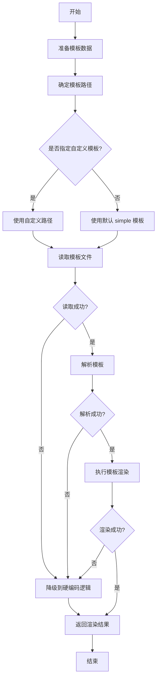

# Prompt 模板系统说明

## 概述

本文档说明了 Daily Summary 项目中 AI Prompt 模板系统的设计和使用方法。

## 改造背景

### 原有实现的问题

在重构之前，prompt 构建逻辑使用硬编码的字符串拼接方式，存在以下问题：

1. **可维护性差**：prompt 内容与代码逻辑耦合，修改 prompt 需要改动 Go 代码
2. **灵活性不足**：无法快速调整 prompt 模板和格式
3. **复用性低**：无法支持多种不同风格的 prompt 模板
4. **难以迭代**：优化 prompt 质量需要频繁修改代码并重新编译

### 改造目标

将 prompt 构建改为基于外部模板文件的方式，实现：

- **代码与内容分离**：prompt 模板独立为 markdown 文件
- **动态内容注入**：工作记录等动态数据通过模板变量注入
- **多模板支持**：可配置使用不同的模板风格
- **易于迭代**：修改模板无需重新编译代码

## 架构设计

### 模板数据结构

```go
// PromptData 模板数据结构
type PromptData struct {
    Date       string        // 日期（格式：2006-01-02）
    EntryCount int          // 工作记录条数
    Entries    []PromptEntry // 工作记录列表
}

// PromptEntry 单条工作记录
type PromptEntry struct {
    Time    string // 时间（格式：HH:MM）
    Content string // 内容
}
```

### 模板变量

模板文件中可使用以下变量：

| 变量 | 类型 | 说明 | 示例 |
|------|------|------|------|
| `{{.Date}}` | string | 日期 | `2026-01-21` |
| `{{.EntryCount}}` | int | 记录条数 | `15` |
| `{{.Entries}}` | []PromptEntry | 工作记录列表 | - |
| `{{.Time}}` | string | 单条记录的时间 | `14:30` |
| `{{.Content}}` | string | 单条记录的内容 | `完成 API 开发` |

### 模板语法

使用 Go 标准库的 `text/template` 语法：

```markdown
# 工作总结

日期：{{.Date}}

## 工作记录

{{range .Entries}}
- **{{.Time}}**: {{.Content}}
{{end}}

---

## 输出要求
...
```

## 模板文件

### 目录结构

```
daily_summary/
├── templates/
│   ├── summary_prompt.md         # 详细版模板
│   └── summary_prompt_simple.md  # 简洁版模板（默认）
```

### 模板类型

#### 1. 简洁版模板 (`summary_prompt_simple.md`)

**特点**：
- 结构简单清晰
- 输出格式固定
- 适合日常使用

**内容概览**：
- 基本信息（日期、工作记录）
- 四个固定输出部分：主要任务、关键进展、遇到的问题、明日计划

#### 2. 详细版模板 (`summary_prompt.md`)

**特点**：
- 提供详细的输出要求和指导
- 包含注意事项和最佳实践
- 适合需要高质量总结的场景

**内容概览**：
- 基本信息（日期、记录条数、工作记录）
- 详细的输出要求（分类、耗时估算、优先级等）
- 注意事项（准确性、简洁性、结构化等）

## 使用方法

### 1. 使用默认模板

不进行任何配置，系统默认使用 `summary_prompt_simple.md`：

```go
generator := summary.NewGenerator(storage, aiClient, notifier)
// 自动使用 templates/summary_prompt_simple.md
```

### 2. 指定自定义模板

通过 `SetTemplatePath` 方法指定模板路径：

```go
generator := summary.NewGenerator(storage, aiClient, notifier)
generator.SetTemplatePath("templates/summary_prompt.md") // 使用详细版
```

### 3. 创建自定义模板

创建新模板文件 `templates/my_custom_prompt.md`：

```markdown
# 我的自定义总结模板

工作日期: {{.Date}}
总计: {{.EntryCount}} 条记录

## 详细记录

{{range .Entries}}
[{{.Time}}] {{.Content}}
{{end}}

---

请生成一份专业的工作总结...
```

然后在代码中使用：

```go
generator.SetTemplatePath("templates/my_custom_prompt.md")
```

## 错误处理

### 降级机制

当模板加载或解析失败时，系统会自动降级到内置的硬编码逻辑（`buildFallbackPrompt`），确保功能可用性：

```go
// 读取模板文件
templateContent, err := os.ReadFile(templatePath)
if err != nil {
    log.Printf("Warning: failed to read template file %s: %v, using fallback", templatePath, err)
    return g.buildFallbackPrompt(dailyData)
}
```

### 常见错误

| 错误类型 | 原因 | 解决方案 |
|---------|------|---------|
| 模板文件未找到 | 路径错误或文件不存在 | 检查路径，确保模板文件存在 |
| 模板解析失败 | 语法错误 | 检查模板语法，参考 Go template 文档 |
| 模板执行失败 | 变量错误 | 检查模板中使用的变量是否存在于 PromptData |

## 最佳实践

### 1. 模板设计原则

- **清晰的结构**：使用 Markdown 标题和列表组织内容
- **明确的要求**：清楚说明期望的输出格式和内容
- **适度的指导**：提供足够的上下文，但不过度限制
- **可读性优先**：模板本身要易于阅读和维护

### 2. 变量使用建议

- 使用 `{{range}}` 循环遍历工作记录
- 使用条件语句 `{{if}}` 处理可选内容
- 保持变量名清晰且与数据结构一致

### 3. 迭代优化流程

1. **修改模板文件**：直接编辑 markdown 文件
2. **测试效果**：运行 `ds summary` 查看生成的总结
3. **调整优化**：根据效果继续调整模板
4. **无需重启**：模板每次动态加载，无需重启服务

## 实现细节

### buildPrompt 方法流程



### 关键代码片段

```go
// 准备模板数据
entries := make([]PromptEntry, 0, len(dailyData.Entries))
for _, entry := range dailyData.Entries {
    entries = append(entries, PromptEntry{
        Time:    entry.Timestamp.Format("15:04"),
        Content: entry.Content,
    })
}

data := PromptData{
    Date:       dailyData.Date,
    EntryCount: len(dailyData.Entries),
    Entries:    entries,
}

// 解析并执行模板
tmpl, err := template.New("prompt").Parse(string(templateContent))
if err != nil {
    return g.buildFallbackPrompt(dailyData)
}

var buf bytes.Buffer
if err := tmpl.Execute(&buf, data); err != nil {
    return g.buildFallbackPrompt(dailyData)
}

return buf.String()
```

## 未来扩展

### 可能的增强方向

1. **配置化模板选择**：在 `config.yaml` 中指定默认模板
2. **模板校验工具**：提供命令行工具校验模板语法
3. **模板市场**：提供多种预设模板供选择
4. **动态变量扩展**：支持更多上下文信息（如统计数据、趋势分析等）
5. **多语言模板**：支持不同语言的 prompt 模板

### 配置文件支持（待实现）

在 `config.yaml` 中添加模板配置：

```yaml
summary:
  template:
    type: "simple"  # simple | detailed | custom
    custom_path: ""  # 自定义模板路径
```

## 总结

通过引入模板系统，我们实现了：

✅ **代码与内容分离**：模板独立为文件，易于维护  
✅ **灵活的扩展性**：支持自定义模板和多模板切换  
✅ **快速迭代能力**：修改模板无需重新编译  
✅ **健壮的降级机制**：模板失败时自动降级，确保可用性  

这为未来的 prompt 优化和功能扩展奠定了良好的基础。
