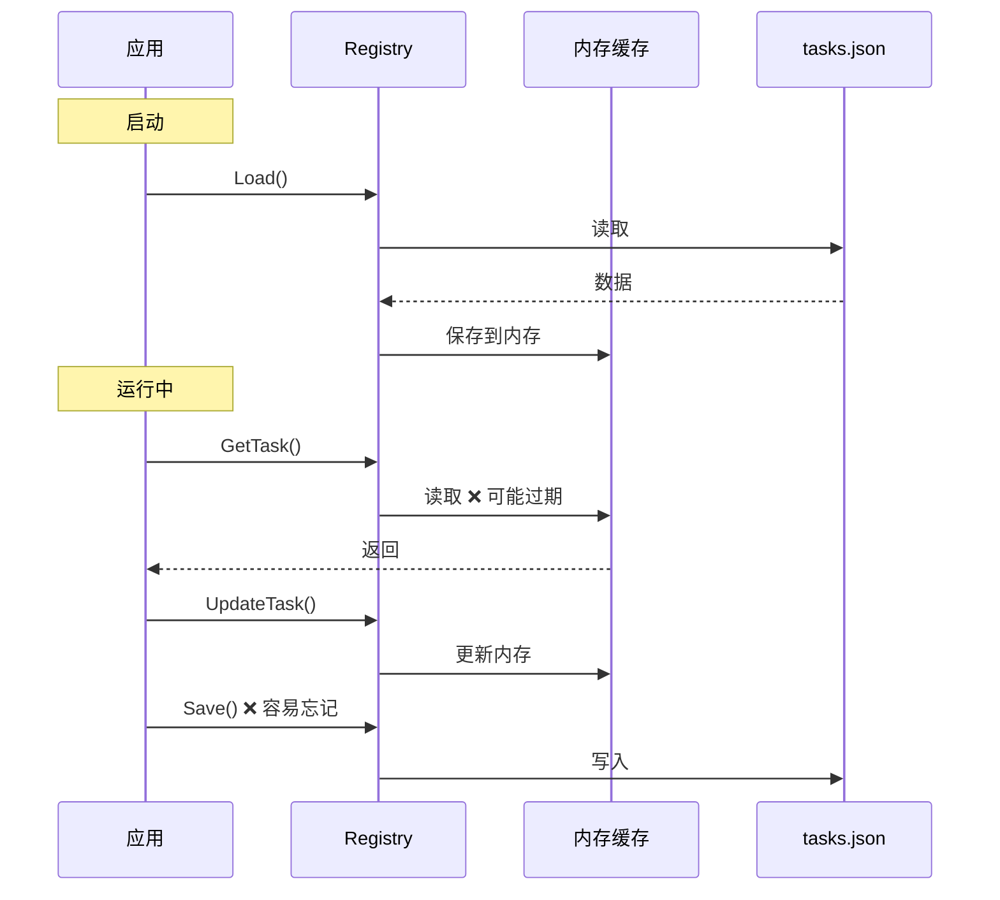
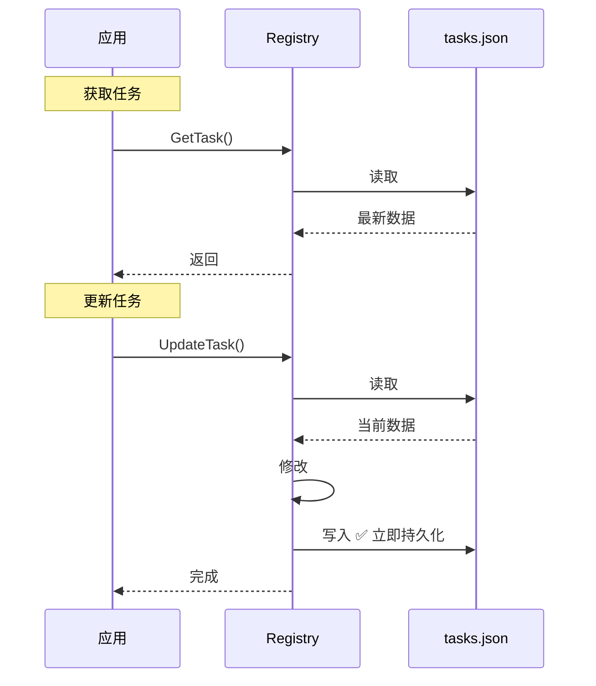

# Registry 架构改进：基于文件的数据存储

## 架构变更

### 🔴 旧设计（内存缓存）

```go
type Registry struct {
    filePath string
    registry *TaskRegistry  // ❌ 内存缓存
    mu       sync.RWMutex
}

// 操作模式：
// 1. Load() 一次加载到内存
// 2. 在内存中修改
// 3. Save() 手动保存
```

**问题：**
- ❌ 内存和文件可能不一致
- ❌ 忘记调用 Save() 导致数据丢失
- ❌ 多进程场景下数据冲突
- ❌ 进程异常退出丢失未保存的数据

### ✅ 新设计（基于文件）

```go
type Registry struct {
    filePath string      // ✅ 只存文件路径
    mu       sync.Mutex  // ✅ 文件操作锁
}

// 操作模式：
// 每个操作都是 Load → 修改 → Save
```

**优点：**
- ✅ 文件是唯一权威数据源
- ✅ 每次操作立即持久化
- ✅ 不存在内存/文件不一致
- ✅ 支持多进程安全访问（带文件锁）

## 实现细节

### 内部方法

#### load() - 从文件加载

```go
func (r *Registry) load() (*TaskRegistry, error) {
    // 1. 检查文件是否存在
    if _, err := os.Stat(r.filePath); os.IsNotExist(err) {
        return &TaskRegistry{Tasks: make([]*TaskConfig, 0)}, nil
    }
    
    // 2. 读取文件
    data, err := os.ReadFile(r.filePath)
    if err != nil {
        return nil, err
    }
    
    // 3. 解析 JSON
    var registry TaskRegistry
    if err := json.Unmarshal(data, &registry); err != nil {
        return nil, err
    }
    
    return &registry, nil
}
```

#### save() - 保存到文件

```go
func (r *Registry) save(registry *TaskRegistry) error {
    // 1. 序列化 JSON
    data, err := json.MarshalIndent(registry, "", "  ")
    if err != nil {
        return err
    }
    
    // 2. 确保目录存在
    dir := filepath.Dir(r.filePath)
    if err := os.MkdirAll(dir, 0755); err != nil {
        return err
    }
    
    // 3. 写入文件
    if err := os.WriteFile(r.filePath, data, 0644); err != nil {
        return err
    }
    
    return nil
}
```

### 公开方法

#### GetTask - 获取单个任务

```go
func (r *Registry) GetTask(id string) *TaskConfig {
    r.mu.Lock()
    defer r.mu.Unlock()
    
    // 1. 从文件加载
    registry, err := r.load()
    if err != nil {
        return nil
    }
    
    // 2. 查找返回
    for _, task := range registry.Tasks {
        if task.ID == id {
            return task
        }
    }
    
    return nil
}
```

**特点：**
- 每次调用都从文件读取
- 确保获取最新数据

#### UpdateTask - 更新任务

```go
func (r *Registry) UpdateTask(config *TaskConfig) error {
    r.mu.Lock()
    defer r.mu.Unlock()
    
    // 1. 加载现有数据
    registry, err := r.load()
    if err != nil {
        return err
    }
    
    // 2. 查找并更新
    found := false
    for i, task := range registry.Tasks {
        if task.ID == config.ID {
            registry.Tasks[i] = config
            found = true
            break
        }
    }
    
    if !found {
        return fmt.Errorf("task not found: %s", config.ID)
    }
    
    // 3. 保存回文件
    return r.save(registry)
}
```

**特点：**
- Load → 修改 → Save 原子操作
- 通过互斥锁保证并发安全

## 数据流对比

### 旧设计



### 新设计



## 调度器使用

### 旧方式（❌ 需要手动保存）

```go
shouldRun, newConfig := task.ShouldRun(now, config)

if newConfig != nil {
    config = newConfig
    s.registry.UpdateTask(config)  // 更新内存
    s.registry.Save()               // ❌ 必须调用 Save
}
```

### 新方式（✅ 自动保存）

```go
shouldRun, newConfig := task.ShouldRun(now, config)

if newConfig != nil {
    config = newConfig
    s.registry.UpdateTask(config)  // ✅ 自动保存到文件
}
```

**简化：**
- 不再需要调用 `Save()`
- `UpdateTask` 内部自动持久化
- 代码更简洁，不易出错

## 性能考虑

### 文件 I/O 频率

**场景分析：**

| 操作 | 频率 | I/O 次数 |
|------|------|---------|
| GetAllTasks | 每分钟1次 | 1次读 |
| UpdateTask (延迟检测) | 每天0-1次 | 1读1写 |
| UpdateTask (任务执行) | 根据间隔 | 1读1写 |

**每小时 I/O 估算：**
- GetAllTasks: 60次读
- UpdateTask: 1-2次读写

**总计：** ~60 次读，1-2 次写/小时

**结论：**
- 📁 Tasks.json 很小（<10KB）
- 💾 读写操作很快（<1ms）
- ⚡ 性能影响可忽略

### 优化策略（如需要）

如果未来性能成为瓶颈，可以考虑：

```go
// 带缓存的读取
func (r *Registry) GetAllTasksWithCache() []*TaskConfig {
    r.cacheMu.RLock()
    if time.Since(r.lastLoad) < 5*time.Second {
        defer r.cacheMu.RUnlock()
        return r.cache
    }
    r.cacheMu.RUnlock()
    
    // 缓存过期，重新加载
    return r.GetAllTasks()
}
```

**但当前不需要！** 简单优于复杂。

## 并发安全

### 单进程场景

```go
type Registry struct {
    mu sync.Mutex  // ✅ 保护文件操作
}

func (r *Registry) UpdateTask(config *TaskConfig) error {
    r.mu.Lock()         // 获取锁
    defer r.mu.Unlock()  // 释放锁
    
    // 原子操作：Load → 修改 → Save
}
```

**保证：**
- ✅ 同一进程内的并发安全
- ✅ Load 和 Save 不会交叉

### 多进程场景（future）

如果需要支持多进程，可以添加文件锁：

```go
import "github.com/gofrs/flock"

func (r *Registry) UpdateTask(config *TaskConfig) error {
    fileLock := flock.New(r.filePath + ".lock")
    fileLock.Lock()
    defer fileLock.Unlock()
    
    // Load → 修改 → Save
}
```

## 数据一致性保证

### 单操作一致性

```
UpdateTask:
  Lock
    ↓
  Load (读取最新)
    ↓
  修改
    ↓
  Save (立即写入)
    ↓
  Unlock
```

**原子性：** 整个操作在锁保护下完成

### 跨操作一致性

#### 场景：任务执行后更新

```go
// 执行任务
err := task.Execute()

// 更新配置
task.OnExecuted(now, config, err)

// 保存（立即持久化）
s.registry.UpdateTask(config)
```

**保证：**
- 任务执行完成 → 立即保存状态
- 不会因为进程退出丢失数据

#### 场景：延迟检测重调度

```go
// 检测到延迟
newConfig.NextRun = 重新计算的时间

// 立即保存
s.registry.UpdateTask(newConfig)

// 下一分钟检查时，获取的是最新时间 ✅
```

## 异常场景

### 1. 文件被手动修改

**旧设计：** ❌ 内存和文件不一致，直到重启

**新设计：** ✅ 下次操作自动获取最新文件内容

### 2. 进程异常退出

**旧设计：** ❌ 未保存的内存数据丢失

**新设计：** ✅ 每次操作都已保存，无数据丢失

### 3. 文件损坏

**两种设计都需要处理：**
```go
registry, err := r.load()
if err != nil {
    log.Printf("Failed to load registry: %v", err)
    // 返回空注册表或重新初始化
}
```

### 4. 磁盘满

**两种设计都会失败，但新设计更早发现：**
```go
if err := r.save(registry); err != nil {
    // 立即返回错误，不会继续执行
    return fmt.Errorf("save failed: %w", err)
}
```

## 迁移影响

### 代码变更

**调度器：**
- ✅ 删除 `Save()` 调用
- ✅ 更新注释说明

**Registry：**
- ✅ 完全重写实现
- ✅ 公开接口不变（兼容）

### 测试变更

**需要更新的测试：**
```go
// 旧测试
registry.AddTask(task)
registry.Save()  // ❌ 不再需要

// 新测试
registry.AddTask(task)  // ✅ 自动保存
```

### 性能影响

**理论：** 文件 I/O 增加

**实际：** 可忽略（tasks.json 很小，操作不频繁）

**测试建议：**
```bash
# 压力测试
for i in {1..1000}; do
    ds list  # 触发 GetAllTasks
done

# 监控 I/O
iostat -x 1
```

## 最佳实践

### 1. 错误处理

```go
if err := s.registry.UpdateTask(config); err != nil {
    log.Printf("Failed to update task: %v", err)
    // 不阻塞后续任务
}
```

### 2. 日志记录

```go
log.Printf("Updating task %s: NextRun=%s", config.ID, config.NextRun)
if err := s.registry.UpdateTask(config); err != nil {
    log.Printf("Update failed: %v", err)
} else {
    log.Printf("Update succeeded")
}
```

### 3. 监控

关注以下指标：
- 文件读写延迟
- 文件读写失败率
- tasks.json 文件大小

## 总结

### 优势

| 方面 | 旧设计 | 新设计 ✓ |
|------|--------|----------|
| 数据一致性 | ❌ 可能不一致 | ✅ 始终一致 |
| 数据丢失风险 | ❌ 异常退出丢失 | ✅ 立即持久化 |
| 代码复杂度 | ❌ 需要手动 Save | ✅ 自动保存 |
| 多进程安全 | ❌ 不支持 | ✅ 易于扩展 |
| 性能 | ✅ 快 | ✅ 足够快 |

### 核心原则

**文件是唯一权威数据源**

所有操作遵循：**Load → 修改 → Save**

这是一个更健壮、更可靠的架构设计！
