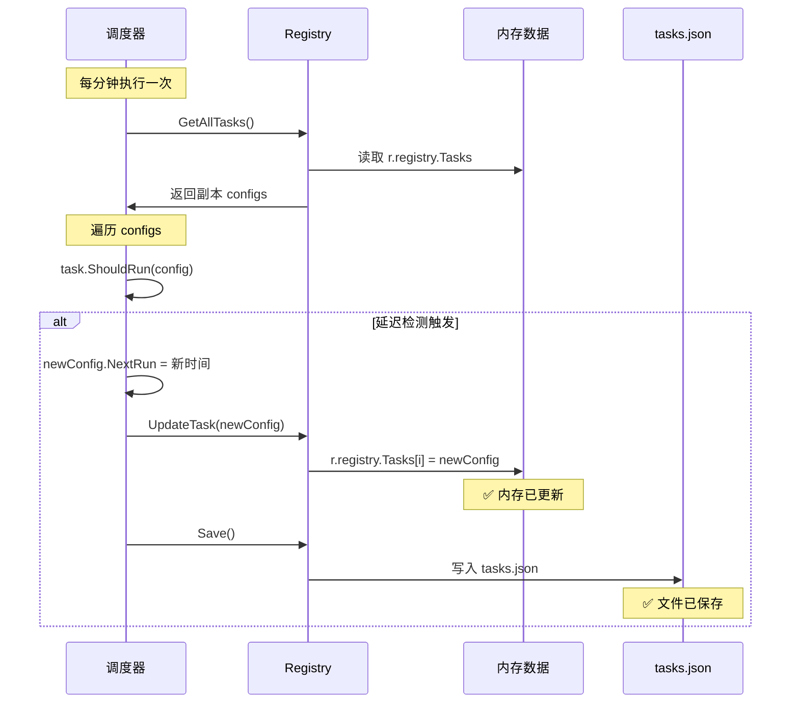

# Registry 配置更新流程分析

## 当前实现

### 数据流



### 代码分析

#### 步骤 1：获取配置（返回副本）

```go
// scheduler.go: 第 137 行
configs := s.registry.GetAllTasks()
```

**GetAllTasks 实现：**
```go
func (r *Registry) GetAllTasks() []*TaskConfig {
    r.mu.RLock()
    defer r.mu.RUnlock()
    
    // 返回副本，避免并发问题
    tasks := make([]*TaskConfig, len(r.registry.Tasks))
    copy(tasks, r.registry.Tasks)
    return tasks
}
```

**重点：**
- `configs` 是一个新的切片
- 但切片中的元素（`*TaskConfig`）是**指针的副本**
- 这些指针仍然指向 Registry 中的同一个 TaskConfig 对象

#### 步骤 2：修改副本

```go
// scheduler.go: 第 165-169 行
shouldRun, newConfig := task.ShouldRun(now, config)

if newConfig != nil {
    config = newConfig  // ❌ 只修改了循环变量
    s.registry.UpdateTask(config)  // ✅ 这里同步回 Registry
    s.registry.Save()
}
```

#### 步骤 3：UpdateTask（关键）

```go
func (r *Registry) UpdateTask(config *TaskConfig) error {
    r.mu.Lock()
    defer r.mu.Unlock()
    
    for i, task := range r.registry.Tasks {
        if task.ID == config.ID {
            r.registry.Tasks[i] = config  // ✅ 更新内存中的指针
            return nil
        }
    }
    
    return fmt.Errorf("task not found: %s", config.ID)
}
```

**关键点：**
- `r.registry.Tasks[i] = config` 更新了 Registry 中的指针
- **下次 `GetAllTasks()` 会返回更新后的配置** ✓

## 验证流程

### 场景：延迟检测触发

#### 第 1 次检查（09:00:00）

```go
// 1. 获取配置
configs := s.registry.GetAllTasks()
config := configs[0]  // work-reminder
// config.NextRun = 22:45:00 (昨晚)

// 2. 延迟检测触发
shouldRun, newConfig := task.ShouldRun(now, config)
// newConfig.NextRun = 09:45:00

// 3. 更新 Registry
config = newConfig  // 局部变量
s.registry.UpdateTask(newConfig)  // ✅ Registry 内存已更新
s.registry.Save()  // ✅ 文件已保存

// 此时 Registry 中的数据：
// r.registry.Tasks[0].NextRun = 09:45:00 ✓
```

#### 第 2 次检查（09:01:00）

```go
// 1. 获取配置（重新读取）
configs := s.registry.GetAllTasks()
config := configs[0]  // work-reminder
// config.NextRun = 09:45:00 ✅ 已更新

// 2. 时间检查
if now.Before(config.NextRun) {  // 09:01 < 09:45
    continue  // ✅ 正常跳过
}
```

## 关键问题分析

### Q: GetAllTasks 返回副本，如何感知更新？

**A: 通过 `UpdateTask` 同步回 Registry**

```
GetAllTasks() 返回副本
    ↓
修改副本中的 config
    ↓
UpdateTask(config) ← 同步回 Registry
    ↓
下次 GetAllTasks() 获取最新数据
```

### Q: 为什么要返回副本？

**A: 并发安全**

```go
// 如果直接返回原切片
func GetAllTasks() []*TaskConfig {
    return r.registry.Tasks  // ❌ 多个 goroutine 并发访问会有问题
}

// 返回副本
func GetAllTasks() []*TaskConfig {
    tasks := make([]*TaskConfig, len(r.registry.Tasks))
    copy(tasks, r.registry.Tasks)
    return tasks  // ✅ 每次返回新切片，避免并发修改切片本身
}
```

**但注意：**
- 副本的是**切片**，不是切片中的**元素**
- 切片中的元素是指针，指向同一个 TaskConfig 对象
- 如果要修改 TaskConfig，创建新对象并通过 `UpdateTask` 更新

### Q: 为什么 ShouldRun 要返回新配置？

**A: 避免并发修改原始配置**

```go
// ❌ 错误做法：直接修改
func (t *Task) ShouldRun(config *TaskConfig) {
    config.NextRun = newTime  // 危险：多个 goroutine 可能读取
}

// ✅ 正确做法：创建新对象
func (t *Task) ShouldRun(config *TaskConfig) (*TaskConfig, bool) {
    newConfig := *config  // 复制
    newConfig.NextRun = newTime  // 修改副本
    return &newConfig, false  // 返回新对象
}
```

## 完整流程图

### 正常流程

```
调度器每分钟检查
    ↓
GetAllTasks() → 返回副本切片
    ↓
遍历每个 config 指针
    ↓
ShouldRun(config)
    ↓
┌─────────────┐
│ 返回新配置？ │
└─────────────┘
    ↓
   是 │ 否
    ↓  ↓
UpdateTask │ 跳过
Save()     │
    ↓      ↓
    └──────→ 继续下一个任务
```

### 数据一致性保证

```
内存中的 Registry
    ↕ (UpdateTask)
循环中的副本
    ↕ (Save/Load)
磁盘上的 tasks.json
```

**同步点：**
1. **UpdateTask**：副本 → Registry 内存
2. **Save**：Registry 内存 → 文件
3. **Load**：文件 → Registry 内存（启动时）

## 潜在问题（当前设计下不存在）

### ❌ 如果不调用 UpdateTask

```go
shouldRun, newConfig := task.ShouldRun(now, config)

if newConfig != nil {
    config = newConfig  // ❌ 只修改了局部变量
    // 忘记调用 UpdateTask
    // s.registry.UpdateTask(config)  
}

// 下次检查
configs := s.registry.GetAllTasks()
// config.NextRun 仍然是旧值 ❌
```

**当前代码正确处理了这个问题** ✓

## 测试验证

### 单元测试建议

```go
func TestConfigUpdatePropagation(t *testing.T) {
    tmpDir := t.TempDir()
    registry := NewRegistry(tmpDir)
    
    // 添加初始配置
    config := &TaskConfig{
        ID: "test-task",
        NextRun: time.Now(),
    }
    registry.AddTask(config)
    
    // 获取副本
    configs := registry.GetAllTasks()
    oldNextRun := configs[0].NextRun
    
    // 创建新配置
    newConfig := *configs[0]
    newConfig.NextRun = time.Now().Add(1 * time.Hour)
    
    // 更新
    registry.UpdateTask(&newConfig)
    
    // 重新获取，验证更新
    configs = registry.GetAllTasks()
    if configs[0].NextRun.Equal(oldNextRun) {
        t.Error("Config not updated in registry")
    }
}
```

## 总结

### ✅ 当前实现正确

1. **GetAllTasks 返回副本**：并发安全
2. **UpdateTask 同步回 Registry**：数据一致性
3. **Save 持久化到文件**：数据持久化

### 数据流清晰

```
Registry 内存（权威）
    ↓ GetAllTasks（读）
循环副本（临时）
    ↓ UpdateTask（写回）
Registry 内存（已更新）
    ↓ Save
tasks.json（持久化）
```

### 关键点

- **副本是切片的副本，不是元素的副本**
- **元素是指针，指向同一个 TaskConfig 对象**
- **修改时创建新对象，通过 UpdateTask 更新**
- **下次 GetAllTasks 自然获取最新数据**

这个设计是**正确且优雅**的！
