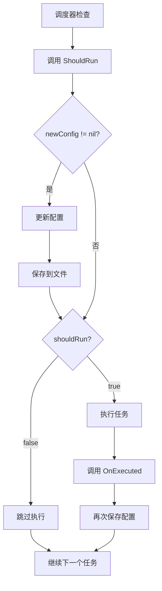

# ShouldRun 接口改进：显式配置更新

## 问题背景

### 原有设计

```go
type Task interface {
    ShouldRun(now time.Time, config *TaskConfig) bool
}
```

**问题：**
- `ShouldRun` 中可能会修改 `config` 指针指向的内容
- **隐式的副作用**：调用者不知道 config 是否被修改
- 调度器需要"猜测"是否要保存配置

**旧的解决方案（不优雅）：**
```go
shouldRun := task.ShouldRun(now, config)

// 问题：不知道 config 是否被修改，只能总保存
if !shouldRun {
    // 总是保存，即使配置未变 ❌
    s.registry.UpdateTask(config)
    s.registry.Save()
    continue
}
```

## 改进设计

### 新接口签名

```go
type Task interface {
    // ShouldRun 判断是否应该执行
    // 返回值：
    //   - shouldRun: 是否应该执行任务
    //   - newConfig: 如果需要更新配置，返回新的配置；否则返回 nil
    ShouldRun(now time.Time, config *TaskConfig) (shouldRun bool, newConfig *TaskConfig)
}
```

### 语义清晰

| 返回值 | 含义 |
|-------|------|
| `(true, nil)` | 应该执行，配置无需更新 |
| `(false, nil)` | 不应执行，配置无需更新 |
| `(false, &newConfig)` | 不应执行，但需要更新配置（如延迟检测） |
| `(true, &newConfig)` | 应该执行，且需要更新配置（理论可能，但当前无此场景） |

### 调度器处理

```go
shouldRun, newConfig := task.ShouldRun(now, config)

// ✅ 明确知道是否需要保存
if newConfig != nil {
    config = newConfig
    s.registry.UpdateTask(config)
    s.registry.Save()
}

if !shouldRun {
    continue
}
```

## 实现对比

### ReminderTask - 延迟检测场景

#### 旧实现（❌ 隐式修改）

```go
func (t *ReminderTask) ShouldRun(now time.Time, config *TaskConfig) bool {
    // ...
    
    if delay > maxDelay {
        // ❌ 直接修改传入的 config
        config.NextRun = t.calculateNextRun(now, config.IntervalMinutes)
        return false
    }
    
    return true
}
```

**问题：**
- 副作用不明显
- 调用者不知道 config 被修改

#### 新实现（✅ 显式返回）

```go
func (t *ReminderTask) ShouldRun(now time.Time, config *TaskConfig) (bool, *TaskConfig) {
    // ...
    
    if delay > maxDelay {
        // ✅ 创建新配置并返回
        newConfig := *config
        newConfig.NextRun = t.calculateNextRun(now, config.IntervalMinutes)
        return false, &newConfig
    }
    
    return true, nil
}
```

**优点：**
- 不修改传入的 config（避免副作用）
- 显式返回新配置
- 语义清晰

### SummaryTask - 无需更新配置

#### 旧实现

```go
func (t *SummaryTask) ShouldRun(now time.Time, config *TaskConfig) bool {
    if !config.Enabled {
        return false
    }
    // ... 其他检查
    return true
}
```

#### 新实现

```go
func (t *SummaryTask) ShouldRun(now time.Time, config *TaskConfig) (bool, *TaskConfig) {
    if !config.Enabled {
        return false, nil  // ✅ 明确表示不需要更新
    }
    // ... 其他检查
    return true, nil
}
```

**优点：**
- `nil` 明确表示"不需要保存"
- 调度器可以跳过不必要的保存操作

### LogRotateTask - 简单逻辑

```go
func (t *LogRotateTask) ShouldRun(now time.Time, config *TaskConfig) (bool, *TaskConfig) {
    if !config.Enabled {
        return false, nil
    }
    
    if config.NextRun.IsZero() {
        return false, nil
    }
    
    return !now.Before(config.NextRun), nil
}
```

## 调度器流程

### 完整执行流程



### 场景演示

#### 场景 1：正常跳过（未到时间）

```go
// ReminderTask
now = 12:29:00
config.NextRun = 12:30:00

ShouldRun() → (false, nil)

// 调度器
newConfig == nil  // ✅ 不保存
!shouldRun        // ✅ 跳过执行
```

#### 场景 2：延迟检测触发

```go
// ReminderTask
now = 09:00:00
config.NextRun = 22:45:00 (昨晚)
delay = 10小时15分钟 > 22.5分钟

newConfig := *config
newConfig.NextRun = 09:45:00
ShouldRun() → (false, &newConfig)

// 调度器
config = newConfig       // ✅ 使用新配置
UpdateTask(config)       // ✅ 更新
Save()                   // ✅ 保存
!shouldRun               // ✅ 跳过执行
```

#### 场景 3：正常执行

```go
// ReminderTask
now = 12:30:05
config.NextRun = 12:30:00
delay = 5秒 < 22.5分钟

ShouldRun() → (true, nil)

// 调度器
newConfig == nil  // ✅ 不提前保存
shouldRun         // ✅ 执行任务
OnExecuted()      // ✅ OnExecuted 会更新 NextRun
UpdateTask()      // ✅ 事后保存
Save()
```

## 优势分析

### 1. 代码清晰度

| 方面 | 旧设计 | 新设计 ✓ |
|------|--------|----------|
| 副作用可见性 | ❌ 隐式修改 | ✅ 显式返回 |
| 调用者理解成本 | ❌ 需要猜测 | ✅ 一目了然 |
| 语义表达 | ❌ 布尔值不够 | ✅ 两个返回值明确 |

### 2. 维护性

**旧设计：**
```go
// 调用者不知道是否修改
shouldRun := task.ShouldRun(now, config)
// 猜测：总是保存？有时保存？
```

**新设计：**
```go
// 一目了然
shouldRun, newConfig := task.ShouldRun(now, config)
if newConfig != nil {
    // 需要保存
}
```

### 3. 性能优化

**旧设计：**
- 总是保存（即使配置未变）
- 每分钟多次不必要的文件写入

**新设计：**
- 只在需要时保存
- 大多数检查不触发保存

```
正常情况每分钟：
- 旧设计：保存 3 次（每个任务检查时）
- 新设计：保存 0 次 ✓

延迟检测触发：
- 旧设计：保存 1 次
- 新设计：保存 1 次
```

### 4. 不可变性原则

**旧设计：**
```go
func ShouldRun(config *TaskConfig) bool {
    config.NextRun = ...  // ❌ 修改传入参数（副作用）
}
```

**新设计：**
```go
func ShouldRun(config *TaskConfig) (bool, *TaskConfig) {
    newConfig := *config    // ✅ 复制
    newConfig.NextRun = ... // ✅ 修改副本
    return false, &newConfig // ✅ 返回新对象
}
```

**好处：**
- 原始 config 不变
- 函数更纯粹
- 避免意外的副作用

## 测试改动

### Mock 对象更新

```go
// 旧实现
type mockAlwaysRunTask struct {
    executed bool
}

func (m *mockAlwaysRunTask) ShouldRun(now time.Time, config *TaskConfig) bool {
    return true
}

// 新实现
func (m *mockAlwaysRunTask) ShouldRun(now time.Time, config *TaskConfig) (bool, *TaskConfig) {
    return true, nil  // ✅ 不需要更新配置
}
```

## 最佳实践

### 1. 何时返回新配置

**应该返回 newConfig：**
- ✅ 需要重新计算 NextRun（延迟检测）
- ✅ 需要更新任何配置字段

**不应该返回 newConfig：**
- ❌ 仅判断逻辑，不修改配置
- ❌ 配置在 OnExecuted 中更新（任务执行后）

### 2. 创建新配置的模式

```go
if needUpdate {
    // ✅ 正确：复制整个结构
    newConfig := *config
    newConfig.FieldToModify = newValue
    return false, &newConfig
}

// ❌ 错误：直接修改原配置
if needUpdate {
    config.FieldToModify = newValue
    return false, config
}
```

### 3. 调度器处理

```go
shouldRun, newConfig := task.ShouldRun(now, config)

// 先处理配置更新
if newConfig != nil {
    config = newConfig  // 替换config引用
    // 保存...
}

// 再判断是否执行
if !shouldRun {
    continue
}

// 执行任务...
```

## 迁移检查清单

- [x] 更新 Task 接口定义
- [x] 更新 ReminderTask.ShouldRun
- [x] 更新 SummaryTask.ShouldRun
- [x] 更新 LogRotateTask.ShouldRun
- [x] 更新调度器中的调用逻辑
- [x] 更新测试中的 mock 对象
- [ ] 运行测试验证
- [ ] 更新相关文档

## 总结

这个改进遵循了**函数式编程**的原则：
- **显式优于隐式**：通过返回值而非副作用表达意图
- **不可变性**：不修改传入参数，而是返回新对象
- **单一职责**：`ShouldRun` 判断 + 可选的配置计算

**核心价值：**
- ✅ 代码更清晰
- ✅ 行为更可预测
- ✅ 维护更容易
- ✅ 性能更优化

这是一个**优雅的 API 设计**！
