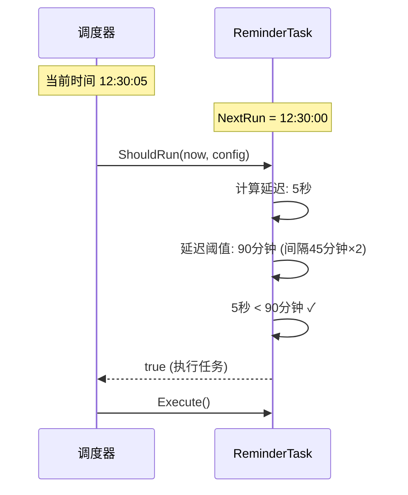
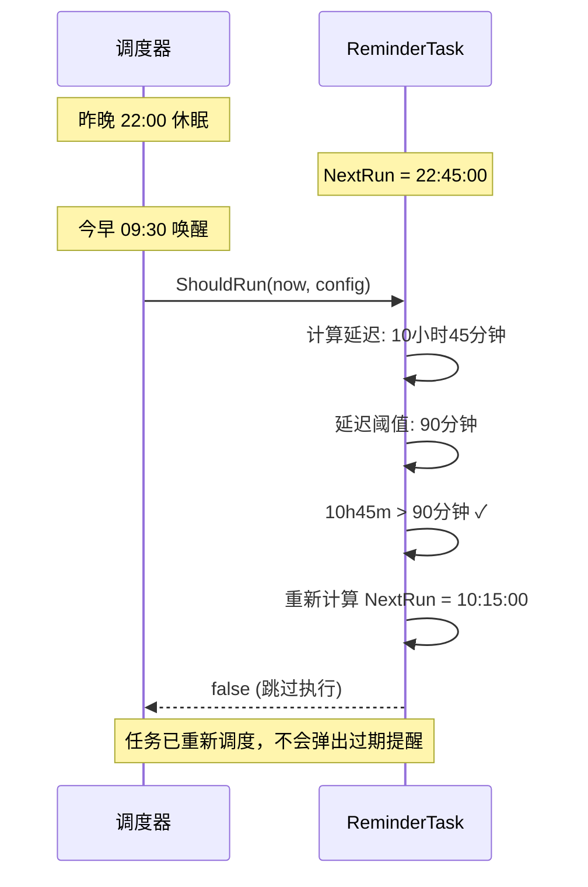
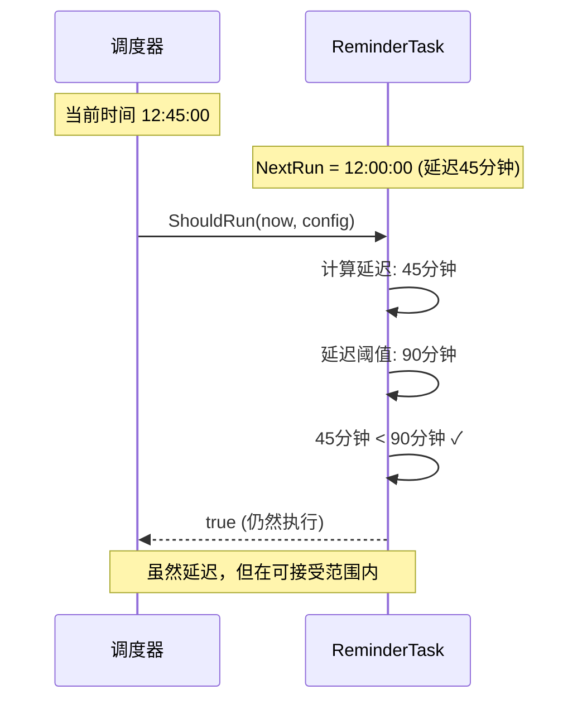

# 任务延迟检测机制

## 问题背景

在实际使用中，可能会遇到以下场景：
- **电脑休眠**：晚上关闭电脑，第二天早上打开
- **服务停止**：手动停止服务一段时间后重启
- **系统挂起**：系统资源不足导致进程暂停

这些情况下，预定的任务执行时间已经过期很久，如果直接执行可能会带来不良体验：
- 弹出多个过期的提醒对话框
- 执行不再需要的任务

## 解决方案

### 延迟检测逻辑

在 `ReminderTask.ShouldRun()` 中添加延迟检测：

```go
func (t *ReminderTask) ShouldRun(now time.Time, config *scheduler.TaskConfig) bool {
    // ... 基础检查 ...
    
    // 计算延迟时间
    delay := now.Sub(config.NextRun)
    maxDelay := time.Duration(config.IntervalMinutes*2) * time.Minute
    
    if delay > maxDelay {
        // 延迟过长，重新计算下次执行时间，跳过本次执行
        log.Printf("Task %s delayed too long (%v > %v), rescheduling...", 
            config.ID, delay, maxDelay)
        config.NextRun = t.calculateNextRun(now, config.IntervalMinutes)
        return false
    }
    
    return true
}
```

### 阈值设定

**延迟阈值 = 间隔时间 × 2**

| 任务间隔 | 延迟阈值 | 说明 |
|---------|---------|------|
| 15 分钟 | 30 分钟 | 允许一定的容错 |
| 30 分钟 | 60 分钟 | |
| 45 分钟 | 90 分钟 | |
| 60 分钟 | 120 分钟 | |

**为什么是 2 倍？**
- 太小（如 1.1 倍）：正常的调度延迟可能被误判
- 太大（如 5 倍）：可能仍然执行过期很久的任务
- **2 倍**：平衡容错性和及时性

## 执行流程

### 场景 1：正常情况



### 场景 2：电脑休眠后唤醒



### 场景 3：短暂延迟



## 日志示例

### 正常执行

```
2026/01/23 12:30:00 [CHECK] Starting task check at 2026-01-23 12:30:00
2026/01/23 12:30:00 [EXECUTE] Task work-reminder (工作记录提醒): starting execution
```

### 检测到延迟过长

```
2026/01/23 09:30:00 [CHECK] Starting task check at 2026-01-23 09:30:00
2026/01/23 09:30:00 Task work-reminder delayed too long (10h45m0s > 1h30m0s), rescheduling...
2026/01/23 09:30:00 [SKIP] Task work-reminder (工作记录提醒): ShouldRun() returned false
2026/01/23 09:30:00 [CHECK] Task check completed at 2026-01-23 09:30:00
```

查看 tasks.json：
```json
{
  "id": "work-reminder",
  "next_run": "2026-01-23T10:15:00+08:00"  // 已重新计算
}
```

## 对比：有无延迟检测

### 没有延迟检测（旧版本）

**场景**：昨晚 22:00 休眠，今早 09:00 唤醒，间隔 45 分钟

```
预定执行时间：
- 22:45
- 23:30
- 00:15
- 01:00
- ... (共 10+ 次)
- 09:00

唤醒后：
- 弹出 10+ 个过期的对话框 ❌
- 用户体验极差
```

### 有延迟检测（当前版本）

```
预定执行时间：22:45
实际唤醒时间：09:00
延迟：10小时15分钟
阈值：90分钟

判断：延迟过长
操作：重新调度到 09:45
结果：不弹出过期对话框 ✓
```

## 配置影响

### 间隔时间对阈值的影响

```yaml
# config.yaml
minute_interval: 30
```

**效果：**
- 延迟阈值 = 30 × 2 = 60 分钟
- 如果延迟超过 1 小时，任务会被重新调度

**建议：**
- 间隔较短（15-30分钟）：阈值也较短，更严格
- 间隔较长（60分钟）：阈值较长，更宽松

## 边界情况

### 1. 延迟恰好等于阈值

```go
if delay > maxDelay {  // 使用 > 而非 >=
    // 跳过
}
```

- `delay == maxDelay`：仍然执行
- `delay > maxDelay`：跳过执行

### 2. NextRun 为零值

```go
if config.NextRun.IsZero() {
    return false  // 在延迟检测之前已处理
}
```

### 3. 负延迟（时钟回拨）

```go
delay := now.Sub(config.NextRun)
```

- 如果时钟回拨，`delay` 为负数
- 负数不会 `> maxDelay`，任务不会执行（正确行为）

## 其他任务的处理

### SummaryTask（每日总结）

**不需要延迟检测**，原因：
- 每天只执行一次
- 有明确的时间点（如 11:00）
- ShouldRun 中已经有日期检查逻辑

```go
// SummaryTask 的 ShouldRun
if lastDate == today {
    return false  // 今天已生成，不再执行
}
```

### LogRotateTask（日志轮转）

**不需要延迟检测**，原因：
- 每 3 小时执行一次
- 延迟执行不影响功能（轮转晚一点无所谓）
- 不涉及用户交互

## 优势总结

| 方面 | 没有延迟检测 | 有延迟检测 ✓ |
|------|------------|------------|
| 电脑休眠场景 | ❌ 弹出多个过期提醒 | ✅ 自动跳过过期任务 |
| 用户体验 | ❌ 差 | ✅ 好 |
| 任务时效性 | ❌ 执行过期任务 | ✅ 只执行有效任务 |
| 日志清晰度 | ❌ 无说明 | ✅ 记录延迟和重调度 |

## 调试建议

### 查看延迟检测日志

```bash
# 查找延迟检测记录
grep "delayed too long" run/logs/app.log
```

### 查看任务重调度

```bash
# 查看调度器检查日志
grep "ShouldRun() returned false" run/logs/scheduler_check.log
```

### 验证 NextRun 更新

```bash
# 查看任务配置
cat run/tasks.json | jq '.tasks[] | select(.id=="work-reminder") | {id, next_run}'
```

## 最佳实践

1. **合理设置间隔**：根据实际需求设置提醒间隔
2. **关注日志**：定期检查延迟检测日志，了解任务行为
3. **测试场景**：模拟休眠场景，验证延迟检测是否正常工作

这个机制确保了在各种异常情况下，任务调度系统都能智能地处理过期任务！
