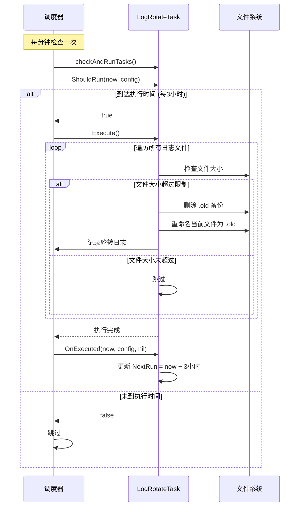

# 日志轮转任务设计

## 设计理念

遵循**关注点分离**原则，日志轮转被实现为一个独立的 Task，而不是耦合到调度器框架中。

### 为什么使用 Task 而非硬编码到 Scheduler？

1. **保持调度器的通用性**：Scheduler 是一个通用的任务调度框架，不应该包含具体的业务逻辑
2. **遵循单一职责原则**：调度器只负责任务的调度，具体做什么由 Task 决定
3. **易于扩展和维护**：新增功能只需要添加新的 Task，不需要修改调度器核心代码
4. **统一的任务管理**：所有任务（提醒、总结、日志轮转）都通过相同的机制管理

## 实现方案

### 1. LogRotateTask 实现

创建了独立的日志轮转任务：`internal/tasks/log_rotate.go`

```go
type LogRotateTask struct {
    logFiles     []string // 需要轮转的日志文件列表
    maxLogSizeMB int      // 日志文件最大大小（MB）
}
```

**核心功能：**
- 支持多个日志文件的轮转
- 检查文件大小是否超过限制
- 执行轮转：重命名为 `.old`，删除旧备份
- 记录轮转操作日志

### 2. 任务配置

在 `internal/scheduler/init.go` 中初始化日志轮转任务：

```go
logRotateTask := &TaskConfig{
    ID:              "log-rotate",
    Name:            "日志文件轮转",
    Type:            TaskTypeInterval,
    Enabled:         true,
    IntervalMinutes: 180, // 3小时 = 180分钟
    NextRun:         now.Add(3 * time.Hour),
}
```

### 3. 任务注册

在 `main.go` 中注册任务实例：

```go
// 注册日志轮转任务（每3小时检查一次）
if cfg.MaxLogSizeMB > 0 {
    logFile := cfg.LogFile
    if logFile == "" {
        logFile = filepath.Join("run", "logs", "app.log")
    }
    checkLogFile := filepath.Join(runDir, "logs", "scheduler_check.log")
    
    logRotateTask := tasks.NewLogRotateTask(
        []string{logFile, checkLogFile},
        cfg.MaxLogSizeMB,
    )
    sched.RegisterTask(logRotateTask)
}
```

## 执行流程



## 任务管理

### 在 tasks.json 中的配置

```json
{
  "tasks": [
    {
      "id": "work-reminder",
      "name": "工作记录提醒",
      "type": "interval",
      "enabled": true,
      "interval_minutes": 45,
      "next_run": "2026-01-23T12:45:00+08:00"
    },
    {
      "id": "daily-summary",
      "name": "每日总结生成",
      "type": "daily",
      "enabled": true,
      "time": "11:00",
      "next_run": "2026-01-24T11:00:00+08:00"
    },
    {
      "id": "log-rotate",
      "name": "日志文件轮转",
      "type": "interval",
      "enabled": true,
      "interval_minutes": 180,
      "next_run": "2026-01-23T15:00:00+08:00"
    }
  ]
}
```

### 启用/禁用任务

可以通过修改 `tasks.json` 中的 `enabled` 字段来控制任务：

```json
{
  "id": "log-rotate",
  "enabled": false  // 禁用日志轮转任务
}
```

## 调度器检查日志示例

### 正常情况（未到执行时间）

```
2026/01/23 12:30:00 [CHECK] Starting task check at 2026-01-23 12:30:00
2026/01/23 12:30:00 [SKIP] Task work-reminder (工作记录提醒): not yet time (NextRun: 2026-01-23 12:45:00)
2026/01/23 12:30:00 [SKIP] Task daily-summary (每日总结生成): not yet time (NextRun: 2026-01-24 11:00:00)
2026/01/23 12:30:00 [SKIP] Task log-rotate (日志文件轮转): not yet time (NextRun: 2026-01-23 15:00:00)
2026/01/23 12:30:00 [CHECK] Task check completed at 2026-01-23 12:30:00
```

### 执行日志轮转

```
2026/01/23 15:00:00 [CHECK] Starting task check at 2026-01-23 15:00:00
2026/01/23 15:00:00 [SKIP] Task work-reminder (工作记录提醒): not yet time (NextRun: 2026-01-23 15:30:00)
2026/01/23 15:00:00 [SKIP] Task daily-summary (每日总结生成): not yet time (NextRun: 2026-01-24 11:00:00)
2026/01/23 15:00:00 [EXECUTE] Task log-rotate (日志文件轮转): starting execution
2026/01/23 15:00:01 [EXECUTE] Task log-rotate (日志文件轮转): execution completed successfully
2026/01/23 15:00:01 [CHECK] Task check completed at 2026-01-23 15:00:00
```

### 主应用日志（app.log）记录轮转详情

```
2026/01/23 15:00:00 Executing task: log-rotate (日志文件轮转)
2026/01/23 15:00:00 Log file rotated: run/logs/scheduler_check.log (12.50 MB) -> run/logs/scheduler_check.log.old
2026/01/23 15:00:00 Log rotation completed: 1 file(s) rotated
```

## 优势分析

### 1. 架构优势

| 方面 | 硬编码到 Scheduler | 实现为 Task ✓ |
|------|------------------|-------------|
| 调度器复杂度 | 增加 | 不变 |
| 代码耦合度 | 高 | 低 |
| 可配置性 | 需修改代码 | 修改配置文件 |
| 可测试性 | 难测试 | 易测试 |
| 扩展性 | 需修改核心 | 添加新 Task |

### 2. 功能优势

- **统一管理**：和其他任务一样出现在 tasks.json 中
- **灵活控制**：可以随时启用/禁用日志轮转
- **状态可见**：可以看到上次执行时间、下次执行时间
- **错误跟踪**：执行失败会记录在 `last_error` 字段中

### 3. 运维优势

- **日志可追溯**：轮转操作记录在调度器检查日志和主应用日志中
- **问题诊断**：如果日志轮转失败，可以在 tasks.json 中查看错误
- **灵活调整**：可以修改 `interval_minutes` 来改变检查频率

## 配置说明

### 执行频率

默认每 **3 小时**检查一次，可以通过修改 `tasks.json` 调整：

```json
{
  "id": "log-rotate",
  "interval_minutes": 60  // 改为每1小时检查一次
}
```

### 轮转阈值

通过 `config.yaml` 中的 `max_log_size_mb` 配置：

```yaml
max_log_size_mb: 10  # 日志超过 10MB 时轮转
```

### 覆盖的日志文件

- `run/logs/app.log` - 主应用日志
- `run/logs/scheduler_check.log` - 调度器检查日志

## 最佳实践

1. **检查频率建议**：3-6 小时（默认3小时）
   - 太频繁：增加系统开销
   - 太少：日志可能会过度增长

2. **日志大小建议**：10-20 MB
   - app.log：根据实际日志量调整
   - scheduler_check.log：10MB 约保留 2 周

3. **监控建议**：
   - 定期检查 tasks.json 中的 `last_error` 字段
   - 关注主应用日志中的轮转记录

## 扩展可能性

基于这个设计，可以轻松扩展其他功能：

1. **数据清理任务**：定期清理过期的工作记录
2. **备份任务**：定期备份重要数据
3. **健康检查任务**：定期检查系统状态
4. **统计任务**：定期生成统计报告

只需要实现 `Task` 接口，注册到调度器即可！
