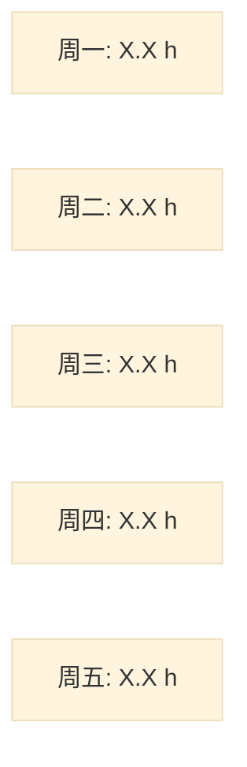

# 周报生成任务

请基于以下每日工作总结生成一份结构化的周报。

## 基本信息

- **周期**: {{.WeekStartDate}} 至 {{.WeekEndDate}}
- **每日总结条数**: {{.EntryCount}}

## 本周每日总结

{{range .DailySummaries}}
### {{.Date}} ({{.Weekday}})

{{if .HasSummary}}
{{.Summary}}
{{else}}
*（当天无工作记录）*
{{end}}

{{end}}

---

## 输出要求

请按照以下格式生成周报，确保内容准确、清晰、有条理：

### 1. 本周完成情况

- 汇总本周完成的主要任务
- 按项目或模块分类整理
- **统计并标注各项目的时间投入（小时，保留1位小数）**
- 突出重要任务和里程碑
- 基于每日总结中的耗时数据进行汇总
- **重要：识别并合并同类项目**
  - 不同日报中描述相似的项目应合并为同一项目
  - 合并时统计总耗时和涉及天数
  - 整合相关工作内容，避免简单罗列

### 2. 本周工作耗时分析

**必须包含以下内容：**

1. **周总工作时长统计**（小时，保留1位小数，以及日均工作时长）

2. **同类项目识别与合并规则**：
   - 分析每日总结中的项目描述，识别语义相似的项目
   - 合并标准：
     - 相同的项目名称（如"账号需求"、"账号系统需求"应合并）
     - 相同的业务领域（如"Oncall 处理"、"Oncall 值班"、"故障处理"应合并）
     - 相似的工作类型（如"PRD 评审"、"需求评审"应合并）
     - 会议类工作可按主题合并（如"技术评审会"、"需求评审会"可归入"评审会议"）
   - 合并后的项目命名：使用最具代表性或出现频率最高的描述
   - 统计每个合并项目的总耗时和涉及天数

3. **按项目/模块的耗时汇总表格**，格式如下：

| 项目/模块 | 本周总耗时（小时） | 占比 | 涉及天数 |
|---------|-----------------|------|---------|
| 项目A | X.X | XX.X% | X天 |
| 项目B | X.X | XX.X% | X天 |

**表格说明**：
- 项目名称应为合并后的统一名称（如"Oncall 处理"而非分散的"Oncall值班"、"故障处理"等）
- 本周总耗时为该项目在各天的耗时总和
- 涉及天数表示本周有几天涉及该项目工作
- 按总耗时从高到低排序

4. **Mermaid 饼图可视化（整周维度）**，代码格式如下：

**饼图说明**：
- 使用合并后的项目名称
- 数据必须与汇总表格完全一致
- 如果项目过多（超过8个），可将占比较小的项目合并为"其他"

5. **可选：每日工作时长趋势图**（如果数据足够），使用 Mermaid 柱状图或折线图

6. **关键发现**（至少包含）：
   - 本周工作时间分配的主要方向（基于合并后的项目）
   - 主要项目的持续性（涉及天数）和专注度分析
   - 会议/沟通类工作的总体占比趋势
   - 开发/执行类工作的占比和效率
   - 各项目时间投入的合理性分析
   - 识别出的同类项目合并情况说明（如果有显著合并）
   - 与上周对比的变化趋势（如有历史数据）

**项目合并示例**：

假设本周每日总结中有以下项目：
- 周一：Oncall 处理（2.0h）、账号需求 PRD 评审（1.0h）
- 周二：Oncall 值班（1.5h）、账号系统技术方案讨论（1.5h）
- 周三：故障排查（2.5h）、Agent 分享准备（1.0h）
- 周四：线上问题处理（1.0h）、账号模块开发（2.0h）、Agent 技术分享会（1.5h）
- 周五：需求评审会（1.0h）

合并后应为：
- **Oncall 处理与故障排查**：7.0h（合并了"Oncall 处理"、"Oncall 值班"、"故障排查"、"线上问题处理"），涉及4天
- **账号需求开发**：4.5h（合并了"账号需求 PRD 评审"、"账号系统技术方案讨论"、"账号模块开发"），涉及3天
- **Agent 技术分享**：2.5h（合并了"Agent 分享准备"、"Agent 技术分享会"），涉及2天
- **评审会议**：1.0h（"需求评审会"），涉及1天

### 3. 关键进展与成果

- 突出本周的重要进展和亮点
- 技术突破或创新点
- 解决的关键问题
- 对项目进度的推动作用
- 团队协作成果

### 4. 遇到的问题与解决方案

- 列出本周遇到的主要问题
- 问题的影响范围和严重程度
- 已采取的解决方案及效果
- 尚未解决的问题和计划
- 需要的支持或资源

### 5. 下周计划

- 基于本周情况规划下周重点
- 优先级排序
- 预计时间分配
- 需要协调的事项
- 潜在风险和应对措施

---

## 注意事项

1. **全局视角**: 从整周维度总结，突出连贯性和整体进展
2. **准确性**: 严格基于提供的每日总结，不要添加未记录的内容
3. **简洁性**: 避免简单复述每日内容，要提炼和归纳
4. **结构化**: 使用清晰的 Markdown 格式，便于阅读
5. **时间统计**: 汇总各项目的时间投入，评估工作分配
6. **趋势分析**: 识别工作模式和效率变化趋势
7. **专业性**: 使用专业术语，保持技术深度
8. **耗时分析必选**: 必须生成"本周工作耗时分析"章节，包含汇总表格、饼图和趋势分析
9. **数据汇总**: 基于每日总结中的耗时数据进行汇总，确保数据准确性
10. **可视化规范**: Mermaid 代码必须正确，饼图和趋势图数据与表格一致
11. **百分比计算**: 所有百分比保留一位小数，总和为 100%
12. **多维分析**: 不仅按项目统计，还要分析会议/开发等工作类型的占比
13. **时间单位规范**: 所有时间统一使用"小时"为单位，保留1位小数。从每日总结汇总时需要将分钟换算为小时（60分钟=1.0小时）
14. **同类项目识别与合并（重要）**:
    - 必须分析并识别不同日报中语义相似的项目，即使文本描述不同
    - 合并规则示例：
      - "账号需求 PRD 评审"、"账号系统需求讨论"、"账号模块设计" → 合并为"账号需求开发"
      - "Oncall 处理"、"Oncall 值班"、"故障排查"、"线上问题处理" → 合并为"Oncall 处理与故障排查"
      - "Agent 分享准备"、"Agent 技术分享会" → 合并为"Agent 技术分享"
      - "PRD 评审"、"需求评审会"、"技术方案评审" → 可合并为"评审会议"
    - 合并时要统计总耗时、涉及天数，并整合工作内容
    - 合并后的项目命名要准确反映工作内容的本质
    - 不要过度合并：如果两个项目虽然类型相似但属于不同业务领域，应保持独立
    - 在表格和饼图中使用统一的合并后项目名称
